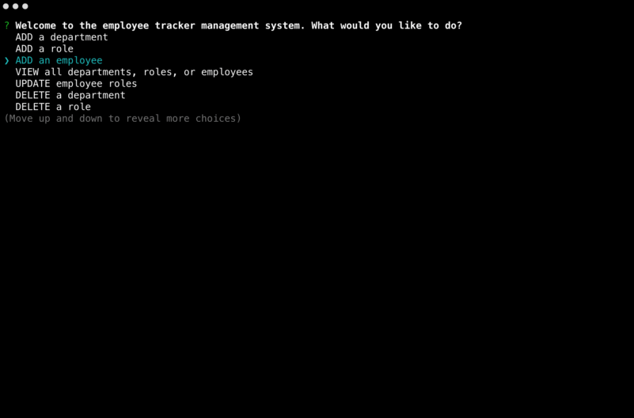

# Employee Tracker CMS

This application is an easy to use CMS for non-developers to view and interact with information stored in a database. This is a solution for managing a company's employees built with Node.js, MySQL, and Inquirer



## Installation

Seed your MySQL database using the seeds.sql file. Then run the following:
```
npm install
node server.js
```
